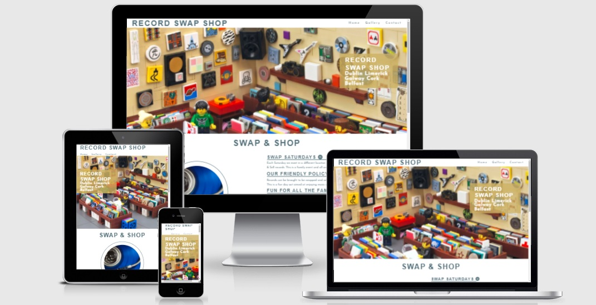
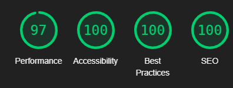

# 
 Eoin Aherne - Portfolio Project 1 - Record Swap Shop 

 

This is a website for a nationwide Record Swap Shop event. It is designed to be fully responsive and accessible across a large range of devices. Laid out in a clear fashion, it should be easy to naviagate for first time and returning users. 

[You can visit the site by clicking this link](https://eoinaherne.github.io/portfolio-project-one/index.html)

# User Experience (UX) 

* ## User stories

* ### First time visitor goals
    
-   As a first time visitor to the site, I want to be able to denounce what the site is about at first glance
-   As a first time visitor to the site, I want to be able to easily naviagte around the site
-   As a first time visitor to the site, I want to find external links via social media that inform me further about the site owners  
    and their reputation outside of their own words

* ### Returning visitor goals

- As a returning visitor to the site, I wan't to find information about events
- As a returning visitor to the site, I wan't to be able to contact the owners of the site easily     
- As a returning visitor to the site, I want to find links to communities such as reddit 

* ### Frequent user goals

- As a frequent user, I want to be able to find updated information about upcoming events
- As a frequent user, I want to see if there has been any updates made to the event
- As a frequent user, I want to join the swap meets and sell or swap my own records

 

# Design

## Colour Scheme

- The colour scheme i chose was from a pallette colour template. I had originally looked for a hero image for the site, i then based the colour pallette i picked to contrast well with the hero image chosen.

## Typograpy

- I researched font types that were used together on Music themed sites such as the one i created. 
- The fonts i chose were 'Josefin Sans' & 'Fira Mono', with sans-serif being used as a backup font, in case a browser wouldn't load the imported choices.

## Imagery 

-I chose to use the 'hero image' style of design for my project. I chose an eyecatching image, that immeadietly informs the viewer of what the site is about. It is also quite detailed and pleasing to look at while spending time on the site

 

## Testing

- I tested that the site works on all browsers, Chrome, Safari, and Firefox.
- I tested the site for its responsiveness at 3 different screen sizes, and across multiple device emulators in the devtools console
- I confirmed that all site links, both internal and external are working as they should
-I tested the form fields to make sure they all require the correct datatypes inputed, and prompt messages appear when expectations are not met, if you try to submit.      

## Bugs 

- When i was creating the readme file i could not get the image to load in my github repository, while it appeared in the readme preview in the code editor. I had an extra /project-portfolio-one/ layer added in, so while the directory appeared correct and the image appeared in the preview, the github file repository link was not the same as the direct link from ../project-portfolio-one/ --> through to the image file.    
- I changed this filepath and the image displayed correctly in my repository. 

## Validator Testing

### HTML
- No errors were returned upon validating my code through the official W3C validator
### CSS
- No errord were returned upon  validating my code through the official W3C Jigsaw validator
### ACCESSIBILITY 
- I achieved a high score for accessibility when generating a Lighthouse report for the site using devtools

## Unfixed Bugs

- No unfixed bugs

## Deployment

### The site was deployed to github pages. The steps to deploy are as follows:
- Click on the settings tab in your current github project repository
- Select the master branch from the dropdown menu
- Click save and the link will be generated to deploy the site. 
[You can visit the site by clicking this link](https://eoinaherne.github.io/portfolio-project-one/index.html)

## Credits

### Acknowledgements
- I would like to thanks my mentor for his great help and support as i was building the site
### Media
- The hero image was taken from Unsplash
### Inspiration
- Ideas for the navigation bar, plus the site layout were taken from the love running project 
### Content
- All content was created by the developer  
